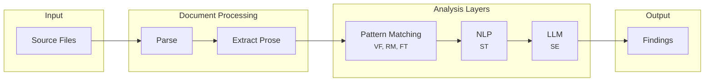

# Architecture

This document describes how aitells analyzes text and how its components fit together. The pipeline has two stages: document processing extracts prose segments from source files, then three analysis layers detect patterns at increasing levels of sophistication.



## Document processing

Document processing parses source files and extracts prose segments for analysis.

### Parser selection
<!-- vale Vale.Spelling = NO -->

Markdown parsing uses [markdown-it-py](https://github.com/executablebooks/markdown-it-py). It's fast, CommonMark-compliant with GFM extensions, and well-maintained by the executablebooks project. The token stream provides line-based position tracking for block elements.
<!-- vale Vale.Spelling = YES -->

### Format adapters

Document processing uses a format adapter pattern. Each supported format has an adapter that yields prose segments. This keeps format-specific parsing isolated from the analysis layers.

Initial adapters:

- **Markdown** - Uses markdown-it-py token stream
- **Plain text** - Treats entire file as prose, splits on blank lines

Future adapters can add RST, AsciiDoc, or other formats without changing analysis code.

### Prose segments

A prose segment is a unit of extractable text with metadata:

- **content** - The text to analyze
- **position** - Source location (path, start line, end line)
- **context** - Element type (paragraph, heading, list item, table cell, block quote)
- **analyzable** - Whether to analyze the segment (the processor skips code blocks and raw HTML)

### Position mapping

Block-level tokens from markdown-it-py include line range maps. When detectors find patterns at character offsets within extracted text, the document processor maps those back to original file positions by computing line and column from the block's line range.

### Directive handling

The processor recognizes inline directives for suppressing analysis:

```markdown
<!-- aitells-ignore -->
This paragraph is skipped entirely.

<!-- aitells-ignore: triads, hedge-stacking -->
This paragraph skips only the specified rules.

<!-- aitells-ignore-start -->
Multiple paragraphs can be skipped
using block suppression directives.
<!-- aitells-ignore-end -->
```

These follow Vale's directive conventions.

### Skipped content

The processor automatically skips:

- Fenced code blocks
- Indented code blocks
- Inline code spans
- Raw HTML blocks
- Front matter (YAML/TOML delimited by `---` or `+++`)
- Link and image URLs

Only prose content flows to the analysis layers.

## Analysis layers

Three layers handle different classes of patterns, ordered by speed and complexity.

### Pattern matching layer
<!-- vale Vale.Spelling = NO -->
<!-- vale Google.WordList = NO -->

The pattern layer uses [Hyperscan](https://github.com/intel/hyperscan) for high-performance regex matching. It compiles all patterns into a single database and matches them simultaneously using SIMD.
<!-- vale Vale.Spelling = YES -->
<!-- vale Google.WordList = YES -->

Capabilities:

- Vocabulary fingerprint detection (VF rules)
- Rhetorical marker identification (RM rules)
- Formatting tell detection (FT rules)

This layer catches lexical tells: patterns identifiable through text matching alone. It runs first because it's fastest and filters candidates for deeper analysis.

### Natural language processing layer
<!-- vale Vale.Spelling = NO -->

The NLP layer uses spaCy for structural analysis. It runs locally with no authentication required.
<!-- vale Vale.Spelling = YES -->

Capabilities:

- Parse tree analysis for triads and parallel structure
- Dependency parsing for hedge stacking detection
- Sentence boundary detection for transition cadence
- Part-of-speech tagging for opener patterns
- Statistical analysis for uniformity metrics

This layer catches structural tells (ST rules): patterns visible in syntax without understanding meaning.

### Language model layer

The LLM layer uses the Claude Agent SDK with Haiku for semantic analysis. When running inside Claude Code, it uses existing authentication. Outside Claude Code, it requires an API key.

Capabilities:

- Context-aware pattern judgment
- Empty conclusion detection
- Artificial balance identification
- Appropriateness evaluation for hedging and sycophancy

This layer catches semantic tells (SE rules): patterns requiring comprehension of meaning and intent.

## Configuration

Configuration lives in `aitells.toml` at the project root:

```toml
[rules]
triads = true
parallel-structure = true
hedge-stacking = true
empty-conclusions = true

[rules.triads]
threshold = 3  # Flag when 3+ triads appear in proximity

[paths]
exclude = ["vendor/", "*.min.js"]
```

Or in `pyproject.toml` under `[tool.aitells]`:

```toml
[tool.aitells]
rules = { triads = true, parallel-structure = true }

[tool.aitells.paths]
exclude = ["vendor/"]
```

## Suppression mechanisms

Three ways to suppress findings.

**Inline comments** silence specific lines:

```markdown
<!-- aitells-ignore -->
This line uses a triad: fast, simple, elegant.

This also works: <!-- aitells-ignore: triads -->
```

**Rule-specific ignores** in configuration:

```toml
[rules.triads]
ignore-patterns = ["Introduction", "Summary"]
```

**Config-level disabling** turns rules off entirely:

```toml
[rules]
triads = false
```

## Output format

Standard output follows the established linter convention:

```text
file:line:col: rule-id - message
```

Example:

```text
docs/guide.md:42:1: triads - Three triads in 5 paragraphs
docs/guide.md:87:15: hedge-stacking - Four hedges in one sentence
```

Exit codes:

| Code | Meaning |
| ---- | ------- |
| 0 | No findings |
| 1 | Findings detected |
| 2 | Error (bad configuration, invalid arguments, internal error) |
